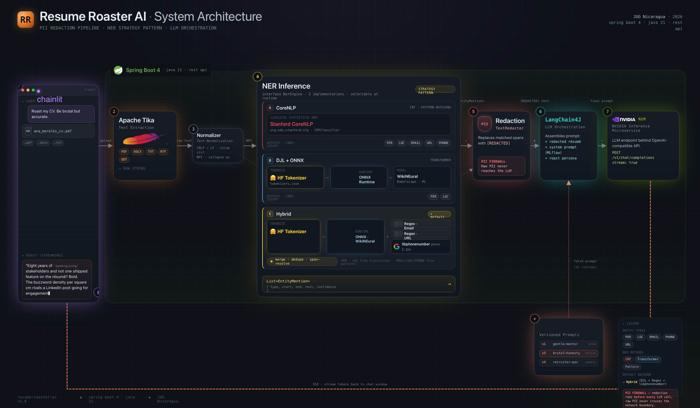

# Resume Roaster AI

This is the demo of a Spring Boot REST API that accepts a CV/resume, redacts personally identifiable information (PII)
before any external
call, and returns AI-generated roast feedback.

It exposes both synchronous and streaming endpoints and integrates a multi-backend NER pipeline with an
OpenAI-compatible LLM calls via [🦜 LangChain4J](https://docs.langchain4j.dev).

## Features

- **Resume roasting** — upload a resume file (PDF, DOCX, ODT, plain text) and receive humorous AI feedback on its
  content
- **PII redaction pipeline** — detects and redacts personal data before the text reaches the LLM
- **Three NER backends** — classical (Stanford CoreNLP), neural (DJL + ONNX transformer encoder), and hybrid (neural +
  rule-based/regex)
- **Streaming support** — Server-Sent Events endpoint emits detected entities first, then LLM tokens as
  OpenAI-compatible chunks
- **Configurable thresholds** — target entity tags and confidence cutoffs are externalized to `application.yaml` as
  configurable API properties.
- **OpenAPI docs** — Scalar UI available at `/docs`




---

## Tech Stack

| Layer            | Technology                                                                             |
|------------------|----------------------------------------------------------------------------------------|
| API              | Java 21, Spring Boot 4                                                                 |
| LLM integration  | [🦜 LangChain4J](https://docs.langchain4j.dev) 1.0 (`@AiService`, `TokenStream`)       |
| LLM backend      | Any OpenAI-compatible API                                                              |
| Classical NER    | [Stanford CoreNLP](https://stanfordnlp.github.io/CoreNLP/) 4.5 (CRF + pattern rules)   |
| Neural NER       | [DJL](https://djl.ai) 0.33 + [ONNX Runtime](https://onnxruntime.ai) (DistilBERT-based) |
| Pattern matching | [Google libphonenumber](https://github.com/google/libphonenumber), custom regex        |
| Document parsing | [Apache Tika](https://tika.apache.org) (via LangChain4J)                               |
| Model registry   | [MLflow](https://mlflow.org) (ONNX artifact download + local cache)                    |
| Build            | Gradle 8 with Version Catalogs                                                         |

---

## Architecture

### PII Redaction Pipeline

```
Uploaded file
     │
     ▼
TextExtractor        (Tika — PDF/DOCX/ODT/text → plain string)
     │
     ▼
TextNormalizer        (Unicode NFC, control chars, whitespace collapse)
     │
     ▼
NerStrategyRegistry  (selects backend from request param)
     │
     ├─ CoreNlpNerStrategy    → Stanford CRF + pattern annotators
     ├─ DjlNerStrategy        → ONNX transformer inference
     └─ HybridNerStrategy     → DJL neural + Email/URL/Phone regex
     │
     ▼
TextRedactor         (replaces each detected span with [REDACTED])
     │
     ▼
LLM Roast (via LangChain4J AiService)
```

### NER Backends

The neural backends
use [🤗 Babelscape/wikineural-multilingual-ner](https://huggingface.co/Babelscape/wikineural-multilingual-ner), a
multilingual DistilBERT model exported to [ONNX](https://onnx.ai) and stored in a MLflow Model Registry.

| Backend                                                    | `nerInferenceBackend` | Entity types                                                 |
|------------------------------------------------------------|-----------------------|--------------------------------------------------------------|
| [Stanford CoreNLP](https://stanfordnlp.github.io/CoreNLP/) | `CORENLP`             | `PERSON`, `EMAIL`, `URL`, `PHONE_NUMBER`                     |
| [DJL](https://djl.ai) + [ORT](https://onnxruntime.ai)      | `DJL`                 | `PER`, `LOC`, `ORG`, `MISC` (configurable)                   |
| DJL + Rules + Regex (default)                              | `DJL_REGEX`           | `PER`, `LOC`, `ORG`, `MISC` + `EMAIL`, `URL`, `PHONE_NUMBER` |

---

## Main API Endpoints

### Resume Roasting

| Method | Path                       | Description                                    |
|--------|----------------------------|------------------------------------------------|
| `POST` | `/api/resume/roast`        | Upload a resume, receive a full roast response |
| `POST` | `/api/resume/roast/stream` | Same, but streamed as Server-Sent Events       |

**Request** — `multipart/form-data`

- `file` — resume file
- `nerInferenceBackend` *(optional)* — `CORENLP`, `DJL`, or `DJL_REGEX` (default: `DJL_REGEX`)

**Response** (`/roast`)

```json
{
    "extractedText": "...",
    "redactedText": "...",
    "answer": "Your resume reads like a LinkedIn profile written by a fortune cookie.",
    "entities": [
        {
            "text": "John Doe",
            "type": "PER",
            "confidence": 0.97,
            "count": 2
        }
    ]
}
```

**SSE stream** (`/roast/stream`) — emits three event types in order:

```
event: entities
data: [{"text":"Jane Smith","type":"PER","confidence":0.97,"count":1},{"text":"jane@acme.com","type":"EMAIL","confidence":1.0,"count":1}]

event: message
data: {"id":"cmpl-abc123","choices":[{"delta":{"content":"Your"},"finish_reason":null}]}

event: message
data: {"id":"cmpl-abc123","choices":[{"delta":{"content":" resume"},"finish_reason":null}]}

data: [DONE]
```

The `message` chunks follow the OpenAI Chat Completions streaming format (`ChatCompletionChunk`). Consume them the same
way you would an OpenAI stream.

### Named Entity Recognition

| Method | Path                    | Backend          |
|--------|-------------------------|------------------|
| `POST` | `/api/ner/entities`     | Stanford CoreNLP |
| `POST` | `/api/ner/entities/djl` | DJL ONNX         |

**Request** — `application/json`

```json
{
    "text": "My name is Jane Smith and I work at Acme Corp."
}
```

Query param: `sortBy` — `CONFIDENCE` (default) or `COUNT`

### Chat

| Method | Path                        | Description          |
|--------|-----------------------------|----------------------|
| `POST` | `/api/chat/response`        | Single-turn LLM chat |
| `POST` | `/api/chat/response/stream` | Streaming version    |

### Health

`GET /api/health` — liveness probe

---

## Configuration

### Environment Variables (required)

| Variable                   | Description                                           |
|----------------------------|-------------------------------------------------------|
| `MLFLOW_TRACKING_URI`      | MLflow server base URL (e.g. `http://localhost:5000`) |
| `MLFLOW_TRACKING_USERNAME` | MLflow basic auth username                            |
| `MLFLOW_TRACKING_PASSWORD` | MLflow basic auth password                            |
| `LLM_BASE_URL`             | OpenAI-compatible LLM endpoint                        |
| `LLM_API_KEY`              | LLM API key                                           |
| `LLM_MODEL_NAME`           | Model name at the LLM endpoint                        |

### Optional Environment Variables

| Variable                  | Default                       | Description                     |
|---------------------------|-------------------------------|---------------------------------|
| `MLFLOW_MODEL_NAME`       | `wikineural-multilingual-ner` | Registered model name in MLflow |
| `MLFLOW_MODEL_VERSION`    | `1`                           | Model version to download       |
| `MLFLOW_MODEL_MAX_LENGTH` | `512`                         | ONNX sequence length            |

### application.yaml Tuning

```yaml
corenlp:
    confidence-cutoff: 0.7       # minimum score for CRF entities
    target-tags:
        - PERSON
        - EMAIL
        - URL
        - PHONE_NUMBER

djl:
    ner:
        confidence-cutoff: 0.5     # minimum score for transformer entities
        target-tags:
            - PER
            - LOC

mlflow:
    tracking-uri: ${MLFLOW_TRACKING_URI}
    username: ${MLFLOW_TRACKING_USERNAME}
    password: ${MLFLOW_TRACKING_PASSWORD}
    model-name: ${MLFLOW_MODEL_NAME:wikineural-multilingual-ner}
    model-version: ${MLFLOW_MODEL_VERSION:1}
    model-max-length: ${MLFLOW_MODEL_MAX_LENGTH:512}

langchain4j:
    open-ai:
        chat-model:
            base-url: ${LLM_BASE_URL}
            api-key: ${LLM_API_KEY}
            model-name: ${LLM_MODEL_NAME}
        streaming-chat-model: # shares the same config as chat-model
            base-url: ${LLM_BASE_URL}
            api-key: ${LLM_API_KEY}
            model-name: ${LLM_MODEL_NAME}
```

---

## Build & Run

### Prerequisites

- Java 21+
- A running [MLflow](https://mlflow.org) tracking server with an ONNX NER model registered
- An OpenAI-compatible LLM server

### Commands

```bash
# Run in development mode (hot reload)
./gradlew bootRun

# Build a production JAR
./gradlew clean build

# Run tests
./gradlew test
```

The API starts on port `8080`. API docs are available at `http://localhost:8080/docs`.

### Running the JAR

```bash
export MLFLOW_TRACKING_URI=http://localhost:5000
export MLFLOW_TRACKING_USERNAME=admin
export MLFLOW_TRACKING_PASSWORD=password
export LLM_BASE_URL=http://localhost:8000/v1
export LLM_API_KEY=sk-...
export LLM_MODEL_NAME=your-model

java -Xmx2g -jar build/libs/resume-roaster-ai-0.0.1-SNAPSHOT.jar
```
